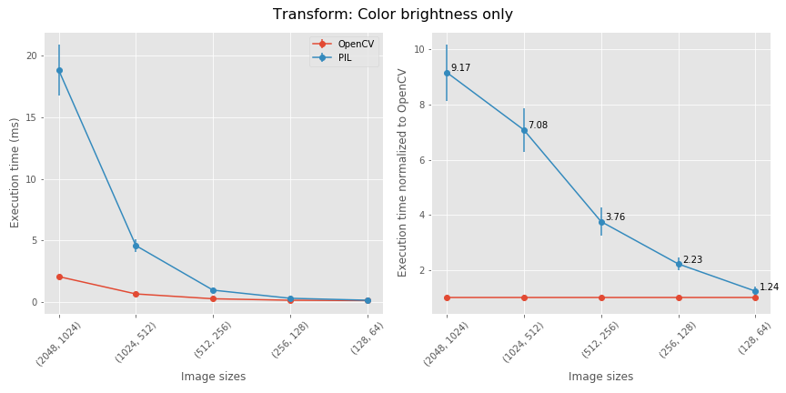
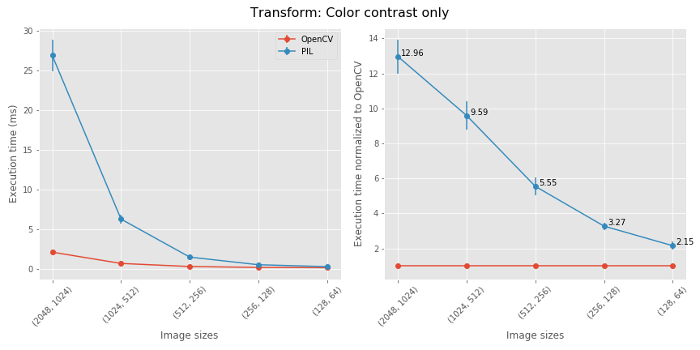
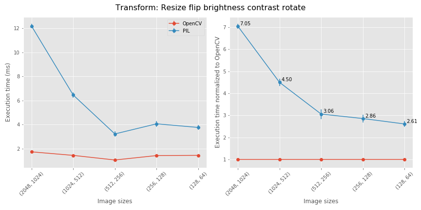

# opencv_transforms

This repository is intended as a faster drop-in replacement for [Pytorch's Torchvision augmentations](https://github.com/pytorch/vision/). This repo uses OpenCV for fast image augmentation for PyTorch computer vision pipelines. I wrote this code because the Pillow-based Torchvision transforms was starving my GPU due to slow image augmentation.

## Requirements
* A working installation of OpenCV. **Tested with OpenCV version 3.4.1**
* Tested on Windows 10.

## Installation
* `git clone https://github.com/jbohnslav/opencv_transforms.git`
* Add to your python path

## Usage
* `from opencv_transforms import opencv_transforms as transforms`
* From here, almost everything should work exactly as the original `transforms`.
#### Example: Image resizing 
`import numpy as np
image = np.random.randint(low=0, high=255, size=(1024, 2048, 3))
resize = transforms.Resize(size=(256,256))
image = resize(image)`
Should be 1.5 to 10 times faster than PIL. See benchmarks

## Performance
* Most transformations are between 1.5X and ~4X faster in OpenCV. Large image resizes are up to 10 times faster in OpenCV.
* To reproduce the following benchmarks, download the [Cityscapes dataset](https://www.cityscapes-dataset.com/). 
* An example benchmarking file can be found in the notebook **bencharming_v2.ipynb** I wrapped the Cityscapes default directories with a HDF5 file for even faster reading. 

The changes start to add up when you compose multiple transformations together.

## TODO
- [x] Initial commit with all currently implemented torchvision transforms
- [x] Cityscapes benchmarks
- [ ] Make the `resample` flag on `RandomRotation`, `RandomAffine` actually do something
- [ ] Speed up augmentation in saturation and hue. Currently, fastest way is to convert to a PIL image, perform same augmentation as Torchvision, then convert back to np.ndarray